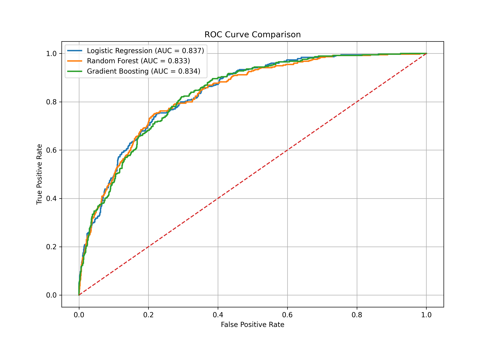
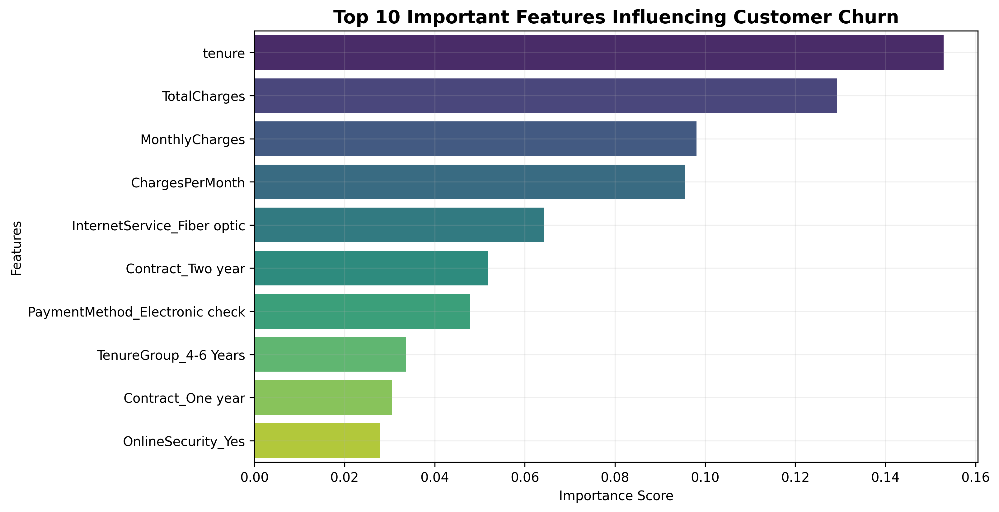
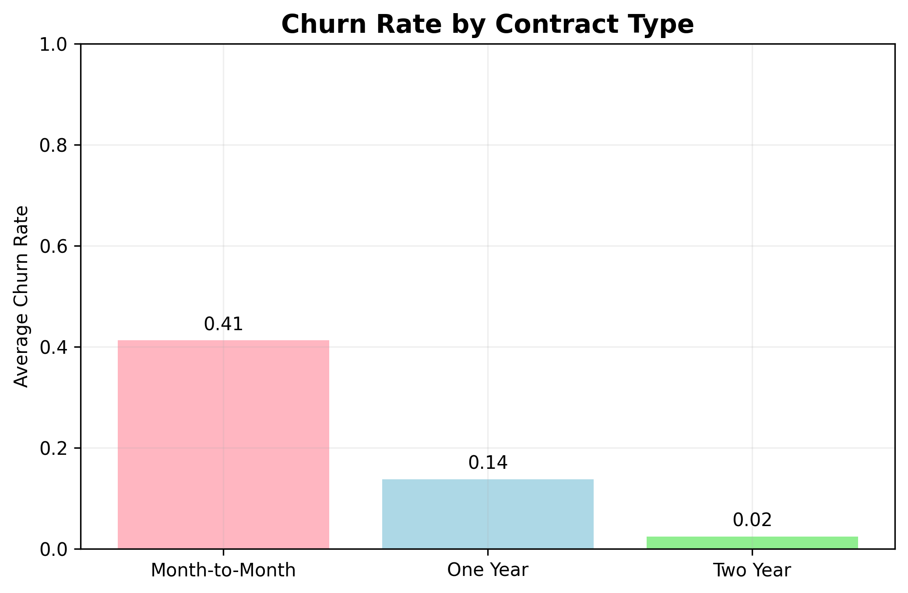
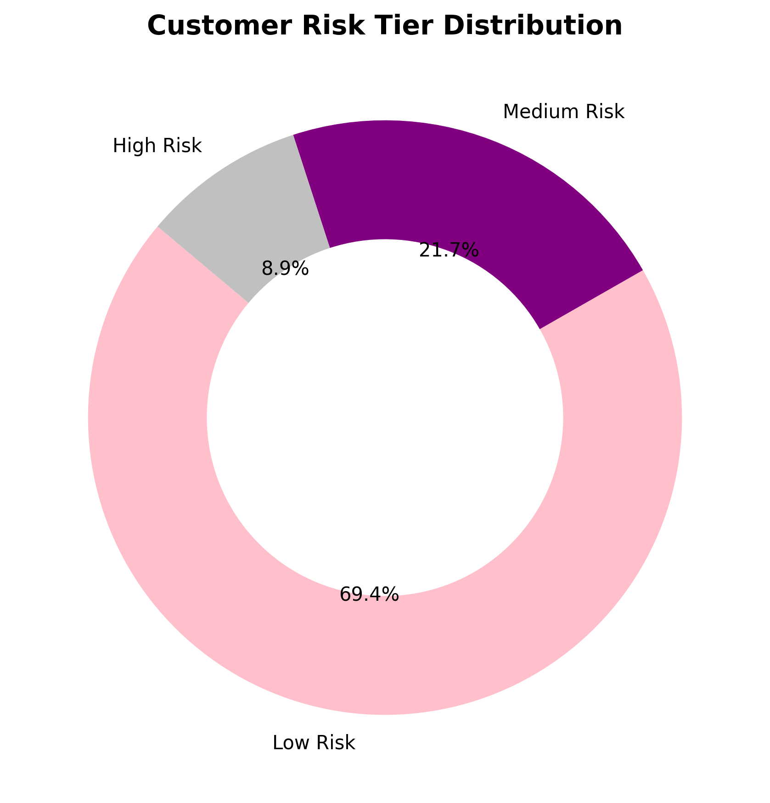
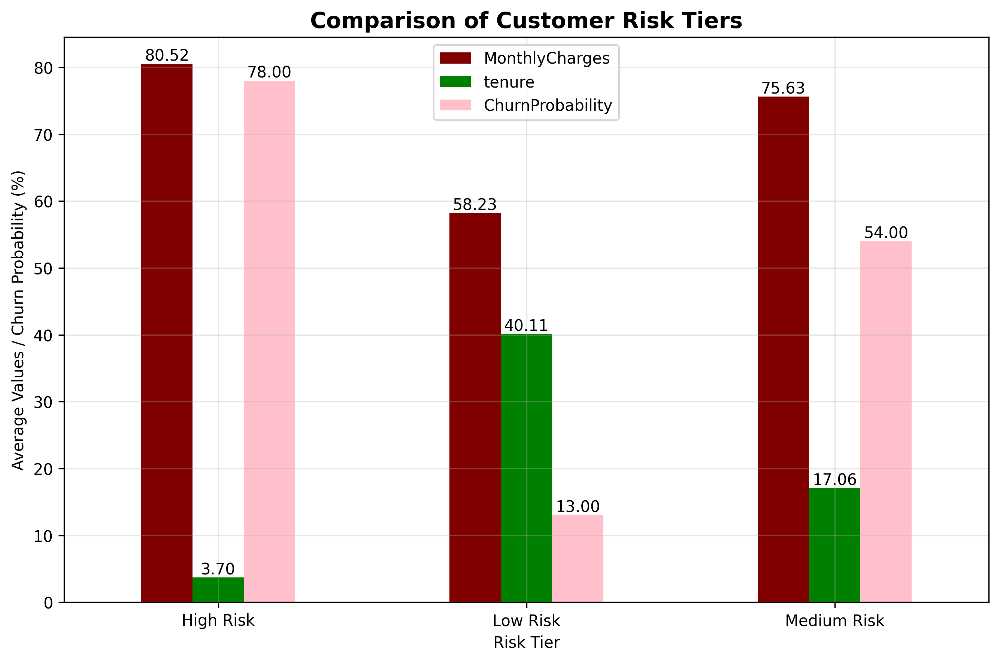
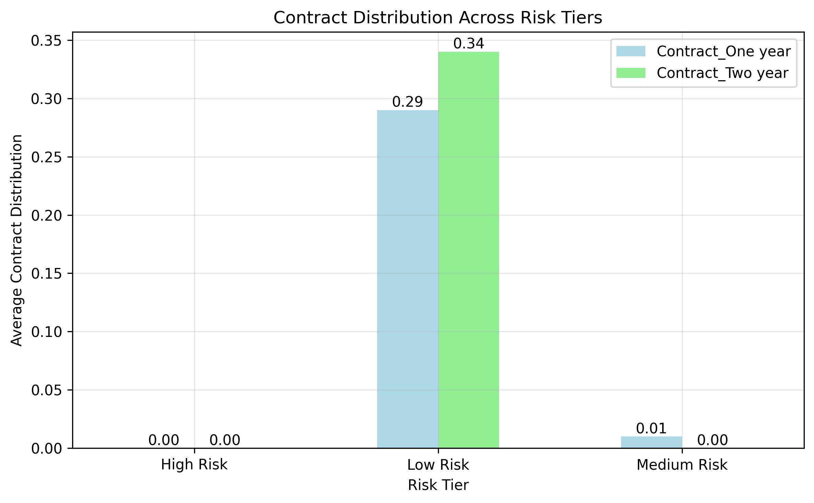
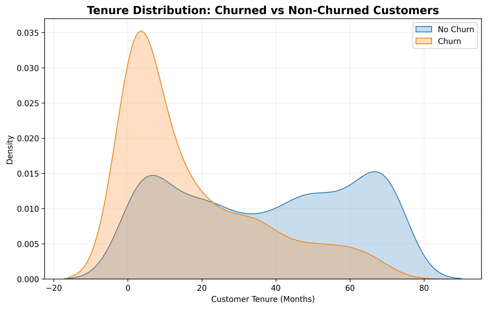

# 📉 Customer Churn Prediction & Risk Segmentation

## 📌 Overview

This project focuses on predicting customer churn for a telecom subscription-based business using Machine Learning techniques and customer risk segmentation.

The objective is to identify customers who are likely to churn and segment them into different risk categories so businesses can take proactive retention actions.

The project follows a complete end-to-end machine learning workflow including:

* Data preprocessing
* Feature engineering
* Exploratory Data Analysis (EDA)
* Model training and evaluation
* Risk segmentation
* Business insight generation
* Data visualization

---

## 🎯 Problem Statement

Customer churn is one of the major challenges for subscription-based businesses. Losing customers directly impacts revenue and business growth.

This project aims to:

* Predict customer churn using classification models
* Identify high-risk customers before churn occurs
* Analyze churn-driving factors
* Generate actionable business recommendations

---

## 🛠️ Tech Stack

* **Python**
* **Pandas**
* **NumPy**
* **Scikit-learn**
* **XGBoost**
* **Matplotlib**
* **Seaborn**
* **Plotly**
* **Jupyter Notebook**

---

## 📂 Dataset

Dataset Used:
**Telco Customer Churn Dataset**

Source:
Kaggle – IBM Telco Customer Churn Dataset

Dataset contains:

* Customer demographics
* Subscription details
* Billing information
* Service usage patterns
* Churn status

Total Records:

* 7,000+ customer records

---

## 🔄 Project Workflow

### 1. Data Loading & Exploration

* Loaded telecom customer dataset using Pandas
* Explored dataset structure and data types
* Identified target variable and class imbalance
* Analyzed missing values and summary statistics

### 2. Data Preprocessing

* Converted `TotalCharges` column to numeric
* Handled missing values and invalid entries
* Encoded categorical variables
* Scaled numerical features using StandardScaler

### 3. Feature Engineering

Created custom features including:

* ChargesPerMonth
* SeniorWithNoSupport
* Tenure-based customer insights

### 4. Model Training

Trained and compared multiple classification models:

* Logistic Regression
* Random Forest Classifier
* XGBoost / Gradient Boosting

### 5. Model Evaluation

Evaluated models using:

* Accuracy
* Precision
* Recall
* F1-Score
* ROC-AUC Score
* Confusion Matrix

### 6. Customer Risk Segmentation

Segmented customers into:

* 🔴 High Risk
* 🟡 Medium Risk
* 🟢 Low Risk

based on churn probability predictions.

### 7. Business Insights & Recommendations

Generated business recommendations based on churn behaviour and customer segmentation analysis.

---

## 📊 Visualizations

### ROC Curve Comparison

Comparison of classification models using ROC-AUC performance.



---

## 📊 Visualizations

### ROC Curve Comparison
Comparison of classification models using ROC-AUC performance.


---

### Feature Importance Analysis
Top features influencing customer churn prediction.



---

### Churn Rate by Contract Type
Analyzes churn behaviour across different contract plans.



---

### Risk Tier Distribution
Distribution of customers across churn risk tiers.



---

### Risk Tier Comparison
Comparison of customer characteristics across risk groups.



---

### Contract Distribution by Risk Tier
Shows contract type distribution across customer risk segments.



---

### Tenure Distribution Analysis
Distribution of tenure among churned and non-churned customers.



## 📈 Key Insights

* Customers with month-to-month contracts showed significantly higher churn rates
* High monthly charges and lower tenure were strong churn indicators
* Long-term contract customers had lower churn probability
* High-risk customers shared common patterns in contract type and billing behaviour

---

## 💡 Business Recommendations

* Offer retention discounts for high-risk customers
* Promote long-term subscription plans
* Improve support services for customers with high monthly charges
* Develop targeted engagement strategies for new customers

---

## 📁 Project Structure

```bash
customer-churn-risk-segmentation/
│
├── Charts/
│   └── Visualization/
│       ├── churn_rate_contract_type.png
│       ├── contract_distribution_risk.png
│       ├── feature_importance.png
│       ├── risk_tier_comparison.png
│       ├── risk_tier_distribution.png
│       └── tenure_distribution.png
│
├── analysis.ipynb
├── model_comparison.png
├── requirements.txt
├── summary.pdf
├── WA_Fn-UseC_-Telco-Customer-Churn.csv
└── README.md
```

---

## ▶️ How to Run

1. Clone the repository

```bash
git clone https://github.com/your-username/customer-churn-risk-segmentation.git
```

2. Install dependencies

```bash
pip install -r requirements.txt
```

3. Launch Jupyter Notebook

```bash
jupyter notebook
```

4. Open:
   `analysis.ipynb`

---

## 💡 Skills Demonstrated

* Machine Learning
* Data Cleaning & Preprocessing
* Exploratory Data Analysis (EDA)
* Feature Engineering
* Classification Modeling
* Model Evaluation
* Risk Segmentation
* Business Analytics
* Data Visualization

---

## 📈 Future Improvements

* Deploy the model using Streamlit
* Perform advanced hyperparameter tuning
* Integrate real-time churn prediction
* Build an interactive dashboard for business teams
* Use advanced ensemble models for better prediction accuracy
